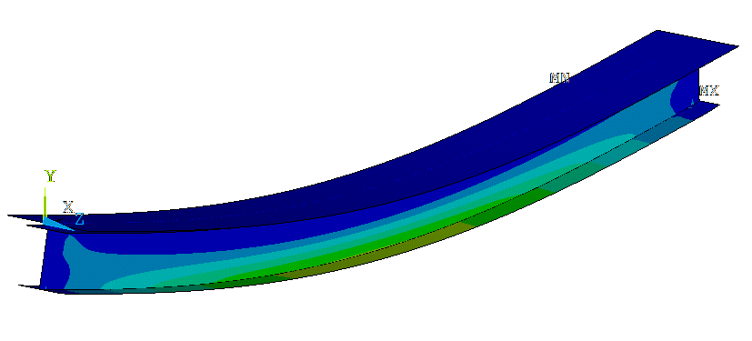

Construction stage analysis
===========================

Minimal example considering a simply supported steel-concrete composite girder.
Demonstrating the activation and deactivation of elements during analysis and summing the results.

__Codes:__ Ansys APDL

Notes
----- 
* simply supported steel-concrete composite I-girder, construction stages, t = 0
* CS1 - bare steel, q1/2 load
* CS2 - composite, t=0; q1 load
* CS1 + CS2 combination

Acknowledgements
----------------

The scripts in this repo have been developed at [Department of Structural Engineering](http://www.epito.bme.hu/hidak-es-szerkezetek-tanszek), Budapest University of Technology and Economics.
 
 
My other Ansys related repos
----------------------------
* [run Ansys in parallel batch mode using Matlab](https://github.com/rozsasarpi/Parallel-Ansys)
* [dynamic load analysis for bridges](https://github.com/rozsasarpi/DLA-Ansys)
* [construction stage analysis](https://github.com/rozsasarpi/CSA-Ansys)